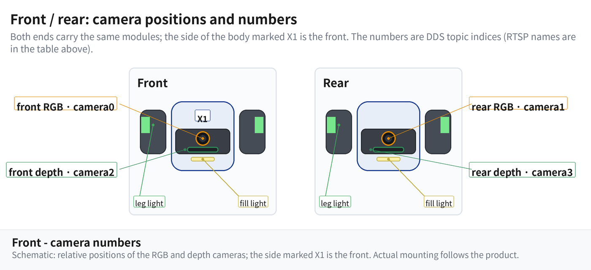

# Robot Outline

This page provides the **numbering reference** for the robot body: camera numbers,
motor numbers and their physical positions.

!!! note "About these figures"
    The markings only show how the numbers map to positions; actual mounting positions
    follow the product.

---

## 1. Camera Numbers

The robot has **4 camera modules**: **2 RGB cameras** and **2 depth cameras**
(the depth cameras also output an RGB image).

The side of the body marked `X1` is the **front**; both ends carry the same modules,
they only differ in their numbers.

| Position | Module type | DDS topic index | RTSP stream name |
| -------- | ----------- | --------------- | ---------------- |
| Front | RGB (primary) | `camera0` | `camera1` |
| Rear | RGB (primary) | `camera1` | `camera2` |
| Front | Depth camera (with RGB) | `camera2` | not streamed |
| Rear | Depth camera (with RGB) | `camera3` | not streamed |

!!! warning "Two independent numbering schemes"
    The **DDS topic index** and the **RTSP stream name** are independent —
    do not infer one from the other (on this model they happen to be offset by 1:
    RTSP `camera1` ↔ DDS `camera0`).

### Topics

| Topic | Message Type | Description |
| ----- | ------------ | ----------- |
| `rt/camera/camera0/image_compressed` | `CompressedImage` | Compressed RGB image (front camera) |
| `rt/camera/camera1/image_compressed` | `CompressedImage` | Compressed RGB image (rear camera) |
| `rt/camera/camera2/image_compressed` | `CompressedImage` | Compressed RGB image (front depth camera) |
| `rt/camera/camera3/image_compressed` | `CompressedImage` | Compressed RGB image (rear depth camera) |
| `rt/camera/camera2/image_depth` | `Image` | Raw depth image (front depth camera, 16UC1) |
| `rt/camera/camera3/image_depth` | `Image` | Raw depth image (rear depth camera, 16UC1) |

---

## 2. Motor Numbers

The robot has **16 joint motors**, numbered `0`–`15`, four per leg. Within a leg the
numbers run from the body outwards: **hip → thigh → knee → leg end**.

The legged and the wheel-legged models use **exactly the same numbering** — the legged
model simply has **no motors `3`, `7`, `11`, `15`** (the leg-end motors that drive the
wheels on the wheel-legged model), which is why it has 12 motors instead of 16:

| Leg         | Wheel-legged   | Legged (point-foot) |
| ----------- | -------------- | ------------------- |
| Front Left  | 0, 1, 2, 3     | 0, 1, 2             |
| Front Right | 4, 5, 6, 7     | 4, 5, 6             |
| Rear Left   | 8, 9, 10, 11   | 8, 9, 10            |
| Rear Right  | 12, 13, 14, 15 | 12, 13, 14          |

---

## 3. Leg Light Identifiers

The high-level LED API identifies legs by **enum**, not by index:

| Enum | Position | Description |
| ---- | -------- | ----------- |
| `Leg.FL` | Front Left | Leg light |
| `Leg.FR` | Front Right | Leg light |
| `Leg.RL` | Rear Left | Leg light |
| `Leg.RR` | Rear Right | Leg light |
| `Leg.FILL_FRONT` | Front | Fill light (point-foot model) |
| `Leg.FILL_BACK` | Rear | Fill light (point-foot model) |
